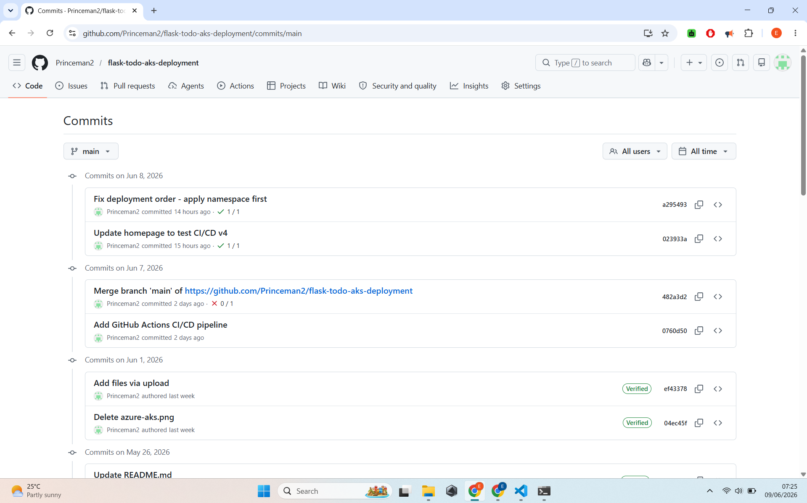
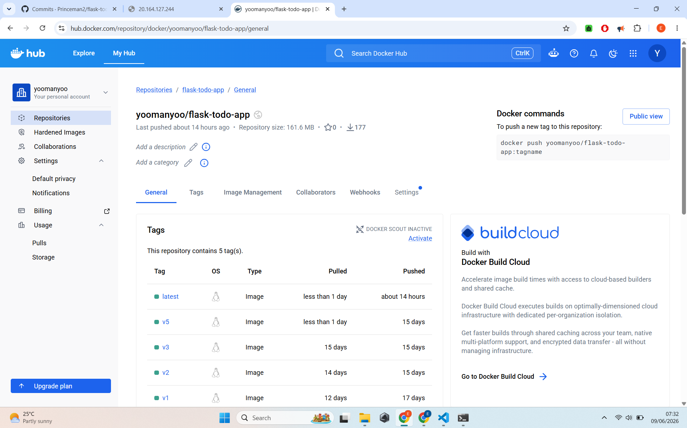

# 🚀 CI/CD Pipeline for Flask Todo App on Azure AKS

Fully automated Continuous Integration and Continuous Deployment pipeline using GitHub Actions for a Python Flask application deployed on Azure Kubernetes Service.


## ✨ Project Overview

Every time code is pushed to the `main` branch, GitHub Actions automatically:
- Builds a new Docker image
- Pushes it to Docker Hub
- Deploys the updated version to Azure AKS

**Live Application:** http://20.164.127.244

## 🛠️ Tech Stack

- **Backend**: Python + Flask + PostgreSQL
- **Containerization**: Docker
- **CI/CD**: GitHub Actions
- **Orchestration**: Kubernetes (AKS)
- **Cloud**: Microsoft Azure

## 📸 Pipeline Screenshots

  
*Complete CI/CD workflow running successfully*

  
*Build, Push to Docker Hub, and Deploy steps*

  
*Triggering the pipeline with a code change*

  
*New version deployed automatically*

  
*Pods and Services after successful deployment*

  
*Latest image successfully pushed to Docker Hub*

## How the Pipeline Works

1. Developer makes changes and pushes to GitHub
2. GitHub Actions automatically triggers
3. Builds and tests Docker image
4. Pushes image to Docker Hub
5. Deploys new version to Azure AKS with zero downtime

## What I Learned

- Building end-to-end CI/CD pipelines
- Secure secret management in GitHub Actions
- Automating Docker builds and Kubernetes deployments
- Azure authentication in CI/CD workflows
- Monitoring and troubleshooting automated deployments

## How to Deploy Manually

```bash
kubectl apply -f k8s/
