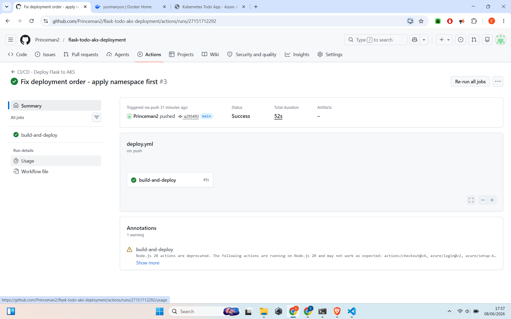
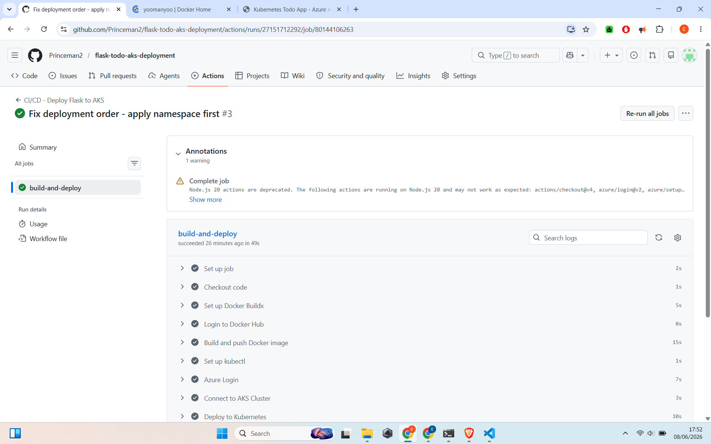
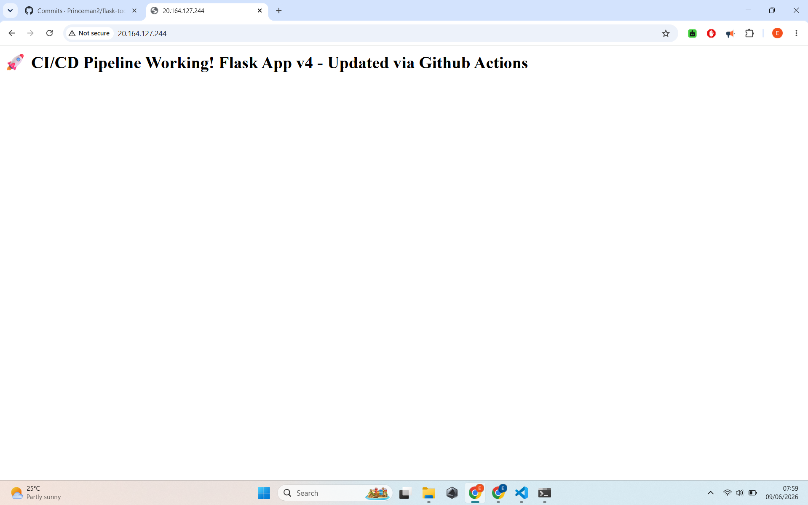
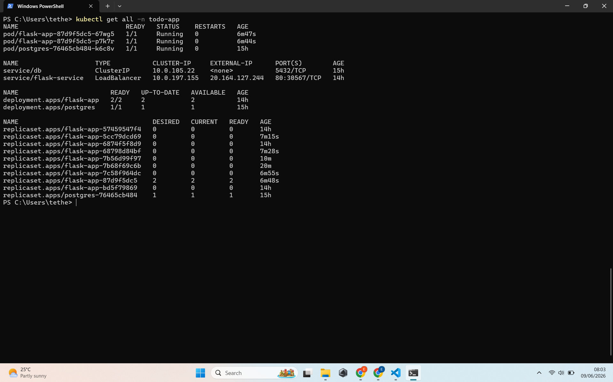

# 🚀 CI/CD Pipeline for Flask Todo App on Azure AKS

Automated Continuous Integration and Continuous Deployment pipeline using GitHub Actions for a Python Flask application deployed on Azure Kubernetes Service.

## ✨ Project Overview

This project demonstrates a complete CI/CD pipeline that automatically:
- Builds a Docker image on every code push
- Pushes the image to Docker Hub
- Deploys the new version to Azure Kubernetes Service

**Live Application:** http://20.164.127.244 (or your current IP)

## 🛠️ Tech Stack

- **Language**: Python + Flask
- **Database**: PostgreSQL
- **Containerization**: Docker
- **CI/CD**: GitHub Actions
- **Orchestration**: Kubernetes (AKS)
- **Cloud**: Microsoft Azure

## 📸 Pipeline Screenshots

  
*Full CI/CD pipeline running successfully*

  
*Build, Push and Deploy steps*

  
*Updated application after automatic deployment*

  
*Pods and Services after deployment*

## How the Pipeline Works

1. Developer pushes code to `main` branch
2. GitHub Actions triggers workflow
3. Builds new Docker image
4. Pushes image to Docker Hub
5. Deploys updated application to AKS
6. Application restarts with zero downtime

## Key Skills Demonstrated

- Automated Docker image building
- Secure secret management in GitHub Actions
- Azure authentication in CI/CD
- Kubernetes deployment automation
- Rollout and zero-downtime updates

## What I Learned

- Building end-to-end CI/CD pipelines
- Working with GitHub Actions workflows
- Managing secrets securely
- Automating cloud deployments

---

Would you like me to adjust anything (add your name, change wording, etc.) before you paste it?

Just reply with **“Repo created”** when the repository is ready, and we’ll finalize everything.
